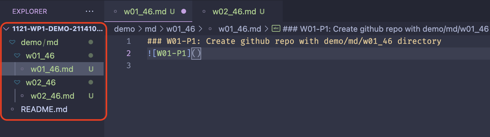
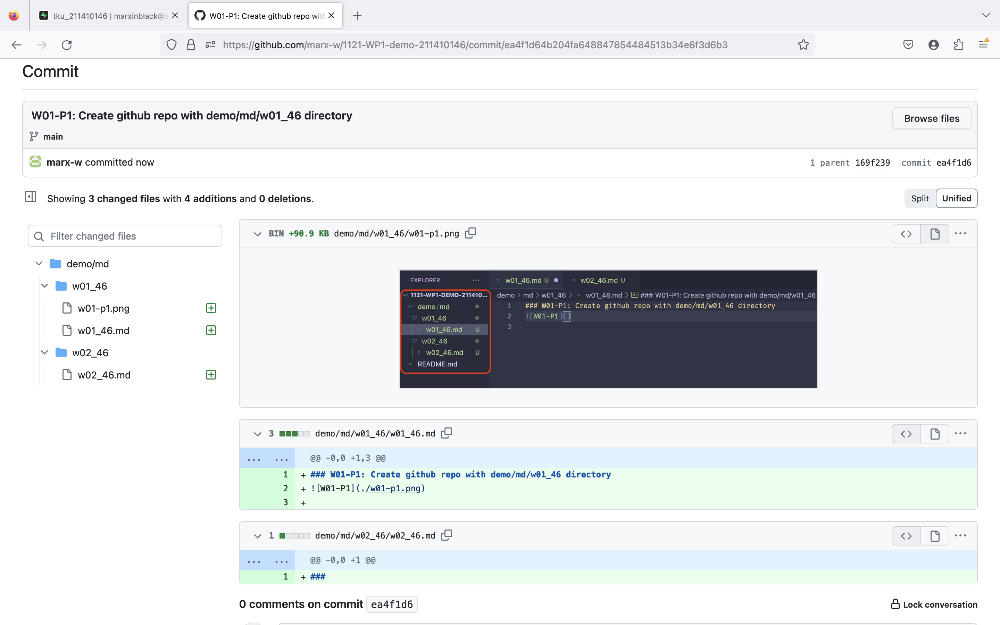
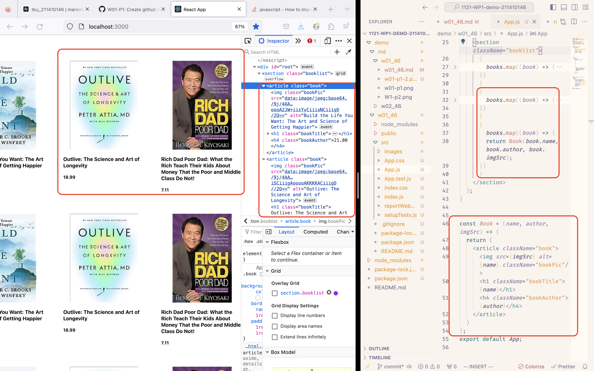
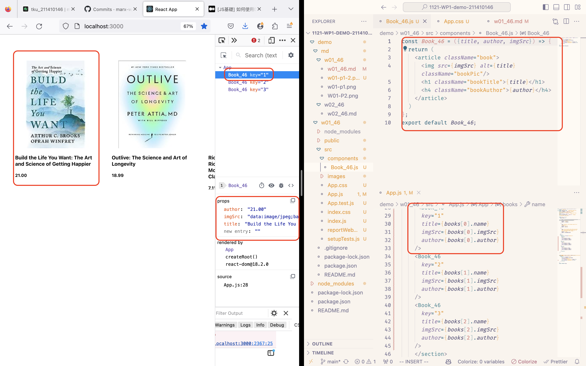
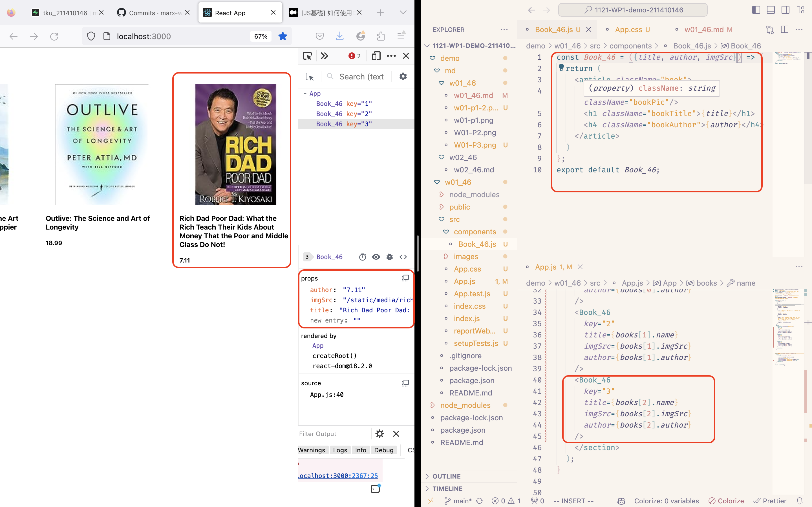

### W01-P1: Create github repo with demo/md/w01_46 directory

### W01-P2: Display first two <Book />

### W01-P3: Display first two <Book_65 />

### W01-P4: Display three different <Book_46 /> and show third <Book_46> in Chrome Dev tools.
