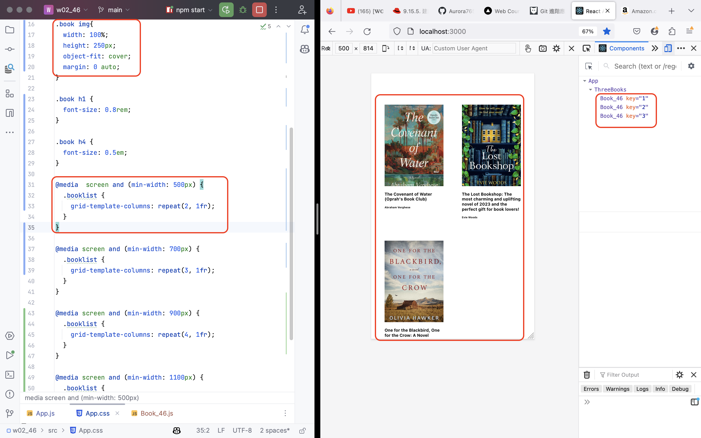
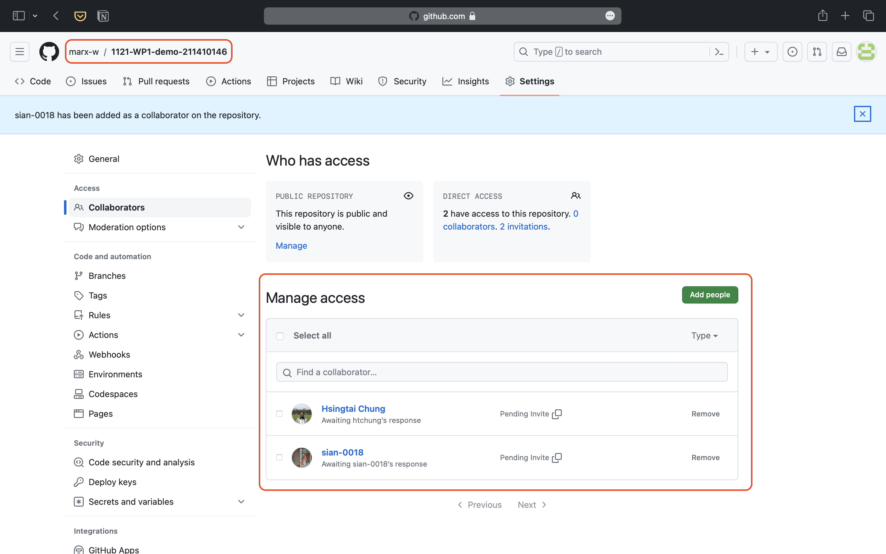
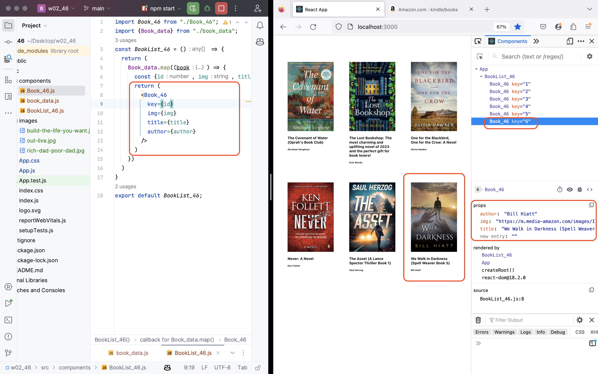
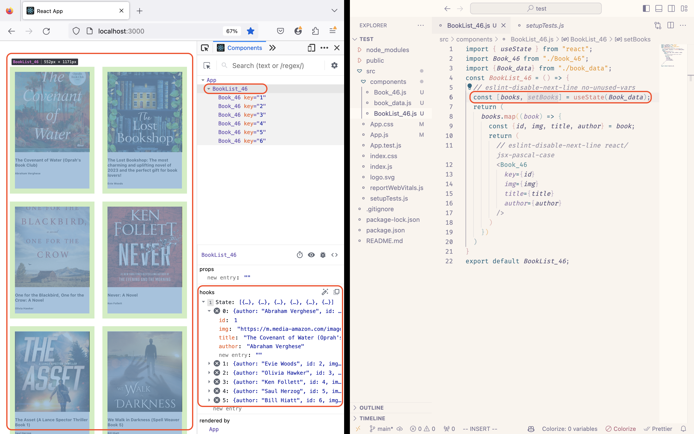

###  W02-P1: modify css to make books responsive




### W02-P2: Share Github Repository to Teacher and Teaching Assistant.


### W02-P3: Use <Booklist_46> to show all books in books_data.js array


### W02-P4: Use useState hook to store all books in books_data.


### W02-Logs: All Logs.


```bash

```