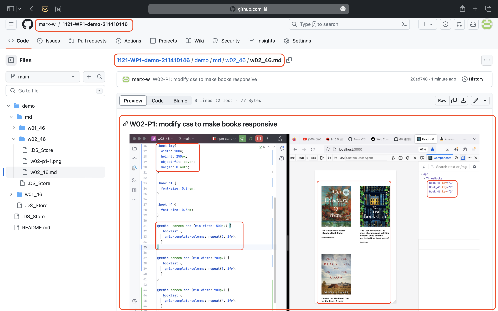
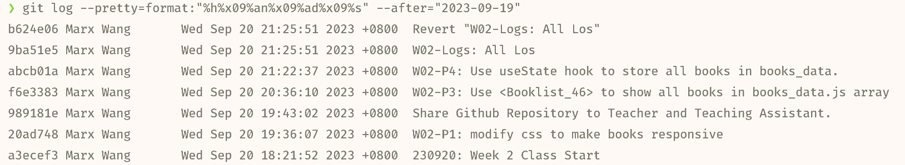

###  W02-P1: modify css to make books responsive




### W02-P2: Share Github Repository to Teacher and Teaching Assistant.


### W02-P3: Use <Booklist_46> to show all books in books_data.js array


### W02-P4: Use useState hook to store all books in books_data.


### W02-Logs: All Logs.



```bash
git log --pretty=format:"%h%x09%an%x09%ad%x09%s" --after="2023-09-19"
```

```bash
abcb01a Marx Wang       Wed Sep 20 21:22:37 2023 +0800  W02-P4: Use useState hook to store all books in books_data.
f6e3383 Marx Wang       Wed Sep 20 20:36:10 2023 +0800  W02-P3: Use <Booklist_46> to show all books in books_data.js array
989181e Marx Wang       Wed Sep 20 19:43:02 2023 +0800  Share Github Repository to Teacher and Teaching Assistant.
20ad748 Marx Wang       Wed Sep 20 19:36:07 2023 +0800  W02-P1: modify css to make books responsive
a3ecef3 Marx Wang       Wed Sep 20 18:21:52 2023 +0800  230920: Week 2 Class Start
```