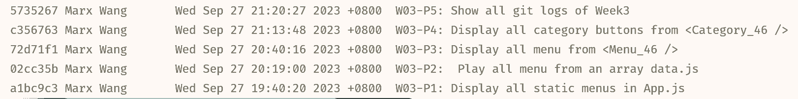

### W03-P1: Display all static menus in App.js


### W03-P2: Play all menu from an array data.js


### W03-P3: Display all menu from <Menu_46 />


### W03-P4: Display all category buttons from <Category_46 />


### W03-P5: Show all git logs of Week3


### W3 Logs: All Logs
```
git log --pretty=format:"%h%x09%an%x09%ad%x09%s" --after="2023-09-26"
```
```
5735267 Marx Wang       Wed Sep 27 21:20:27 2023 +0800  W03-P5: Show all git logs of Week3
c356763 Marx Wang       Wed Sep 27 21:13:48 2023 +0800  W03-P4: Display all category buttons from <Category_46 />
72d71f1 Marx Wang       Wed Sep 27 20:40:16 2023 +0800  W03-P3: Display all menu from <Menu_46 />
02cc35b Marx Wang       Wed Sep 27 20:19:00 2023 +0800  W03-P2:  Play all menu from an array data.js
a1bc9c3 Marx Wang       Wed Sep 27 19:40:20 2023 +0800  W03-P1: Display all static menus in App.js
```

