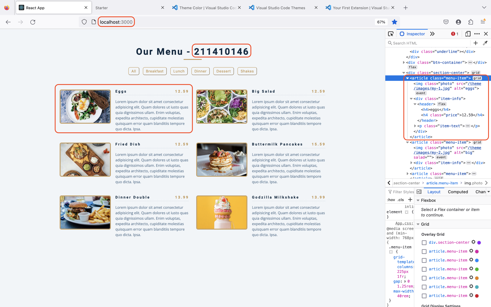
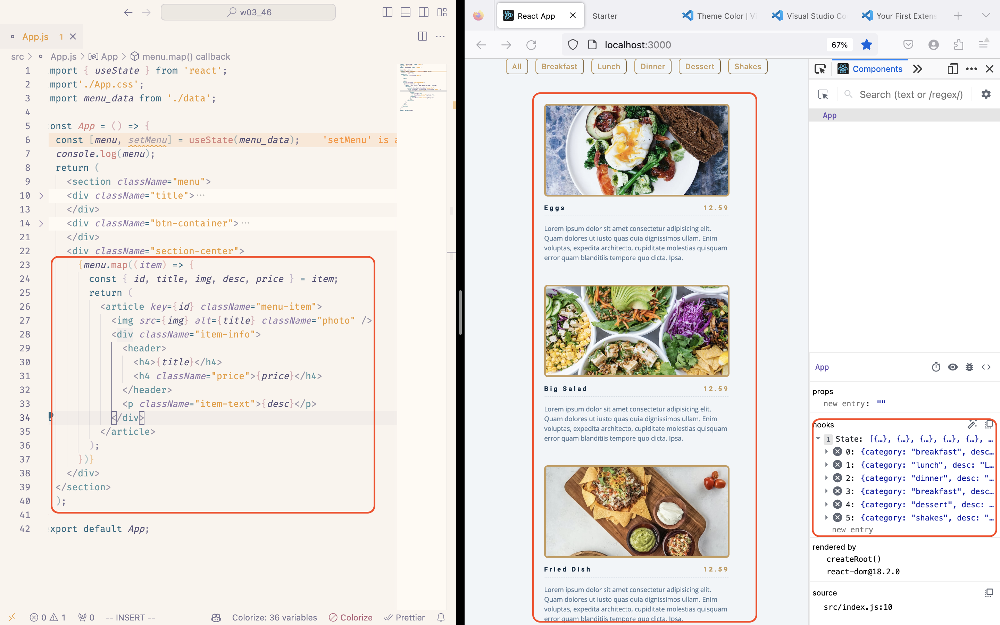
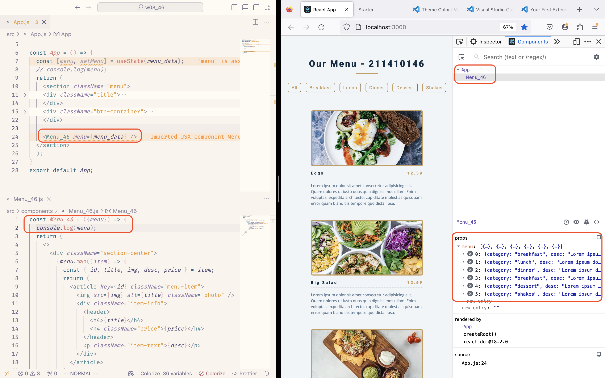
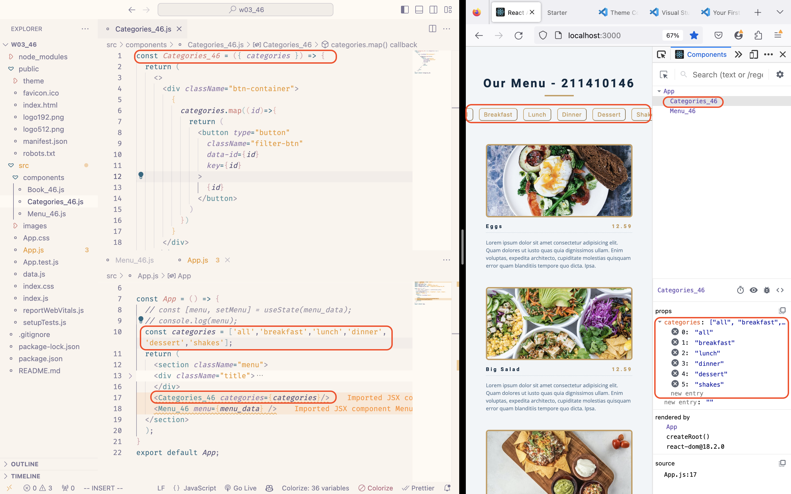
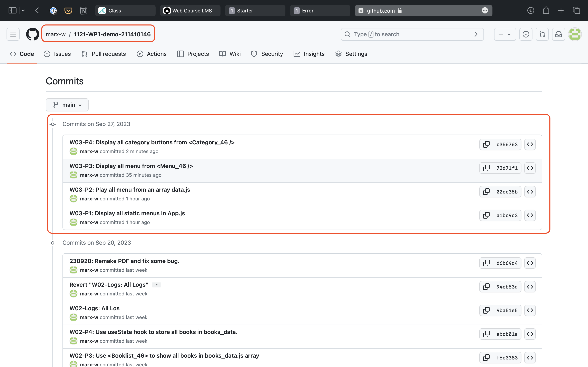

### W03-P1: Display all static menus in App.js




### W03-P2: Play all menu from an array data.js


### W03-P3: Display all menu from <Menu_46 />



### W03-P4: Display all category buttons from <Category_46 />


### W03-P5: Show all git logs of Week3


### W3 Logs: All Logs
```
git log --pretty=format:"%h%x09%an%x09%ad%x09%s" --after="2023-09-26"
```
```
```
