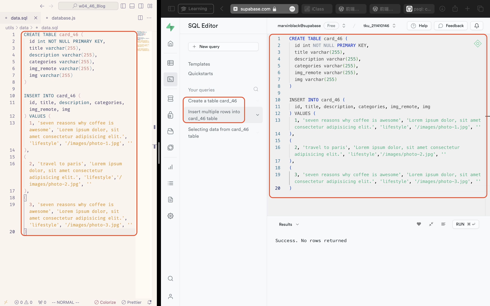
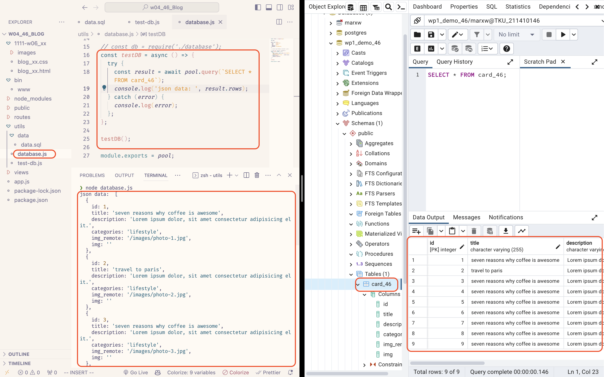
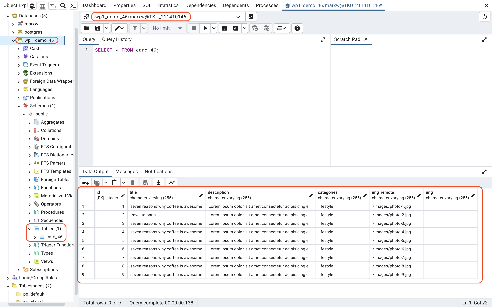
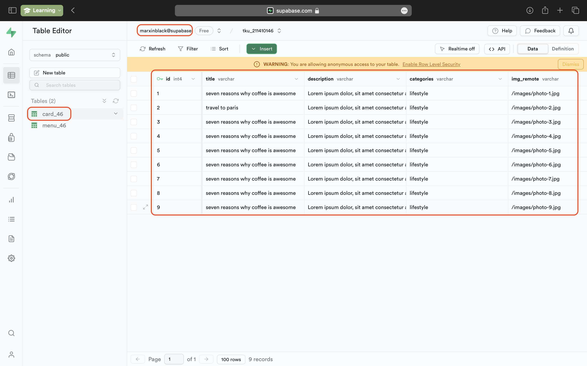

[Github Page]()

### W04-P1: Connect database wp1_demo_46

### W04-P2: Using SQL to create table card_46, and insert two data.

### W04-P3: Using Supabase SQL editor to create table card_46, and insert two data.

### W04-P4: Use JavaScript code to get card_46 data from local wp1_demo_xx database

### W04-P5: Show 9 data in both local PostgreSQL and Supabase

