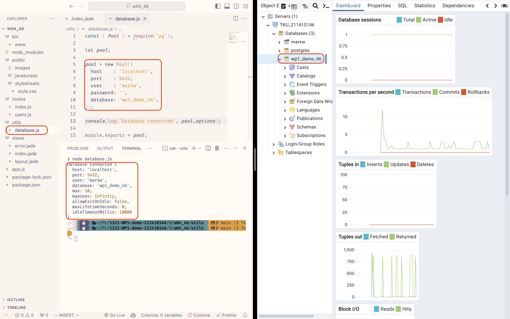
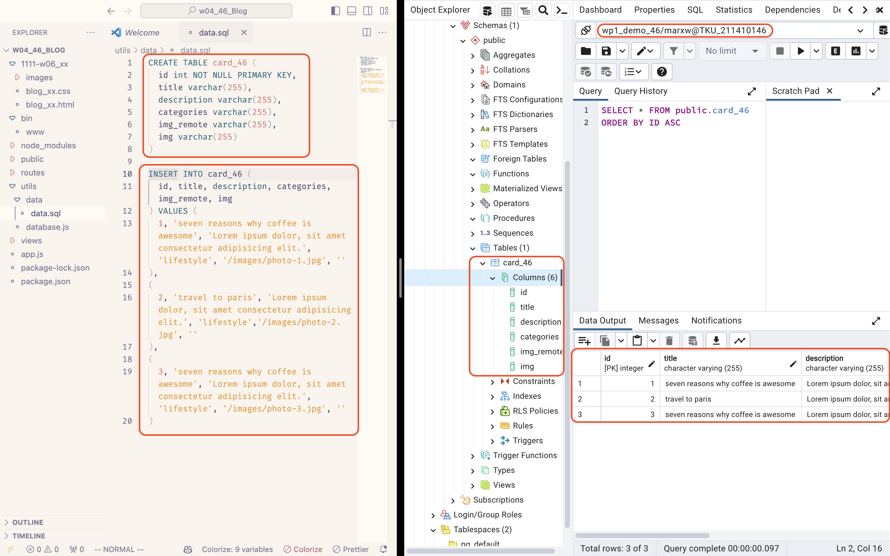

[Github Page](https://github.com/marx-w/1121-WP1-demo-211410146.git)

### W04-P1: Connect database wp1_demo_46


### W04-P2: Using SQL to create table card_46, and insert two data.


### W04-P3: Using Supabase SQL editor to create table card_46, and insert two data.


### W04-P4: Use JavaScript code to get card_46 data from local wp1_demo_xx database


### W04-P5: Show 9 data in both local PostgreSQL and Supabase


### W04-P6: W4 all logs

```
git log --pretty=format:"%h%x09%an%x09%ad%x09%s" --after="2023-10-03"
```
```
da9962a Marx Wang       Wed Oct 4 21:27:09 2023 +0800   W04-P5: Show 9 data in both local PostgreSQL and Supabase
e234860 Marx Wang       Wed Oct 4 21:20:51 2023 +0800   W04-P4: Use JavaScript code to get card_46 data from local wp1_demo_xx database
7de0eb2 Marx Wang       Wed Oct 4 20:48:04 2023 +0800   W04-P3: Using Supabase SQL editor to create table card_46, and insert two data.
9e1ccba Marx Wang       Wed Oct 4 20:21:42 2023 +0800   W04-P2: Using SQL to create table card_46, and insert two data.
77a4609 Marx Wang       Wed Oct 4 19:45:11 2023 +0800   W04-P1: Connect database wp1_demo_46
```