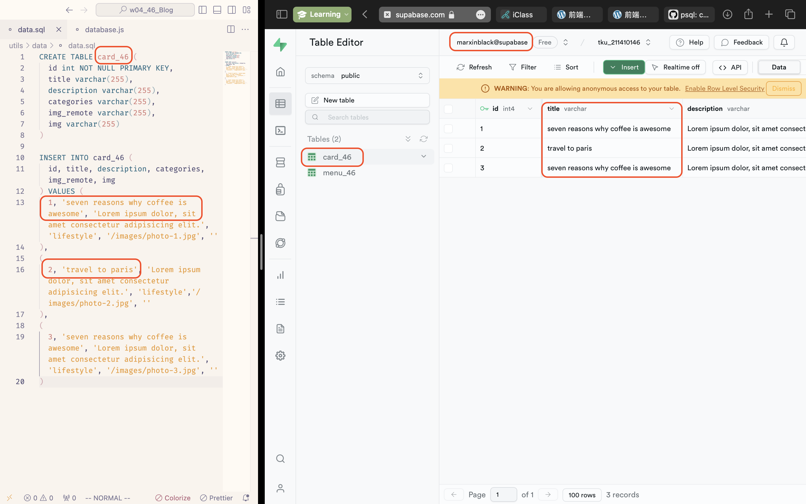

[Github Page]()

### W04-P1: Connect database wp1_demo_46

### W04-P2: Using SQL to create table card_46, and insert two data.

### W04-P3: Using Supabase SQL editor to create table card_46, and insert two data.

