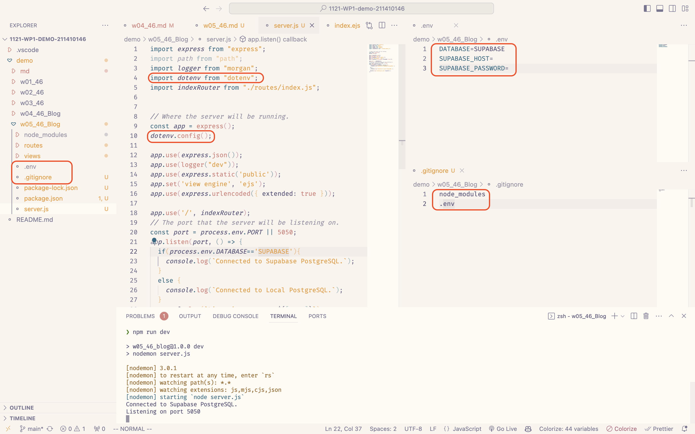
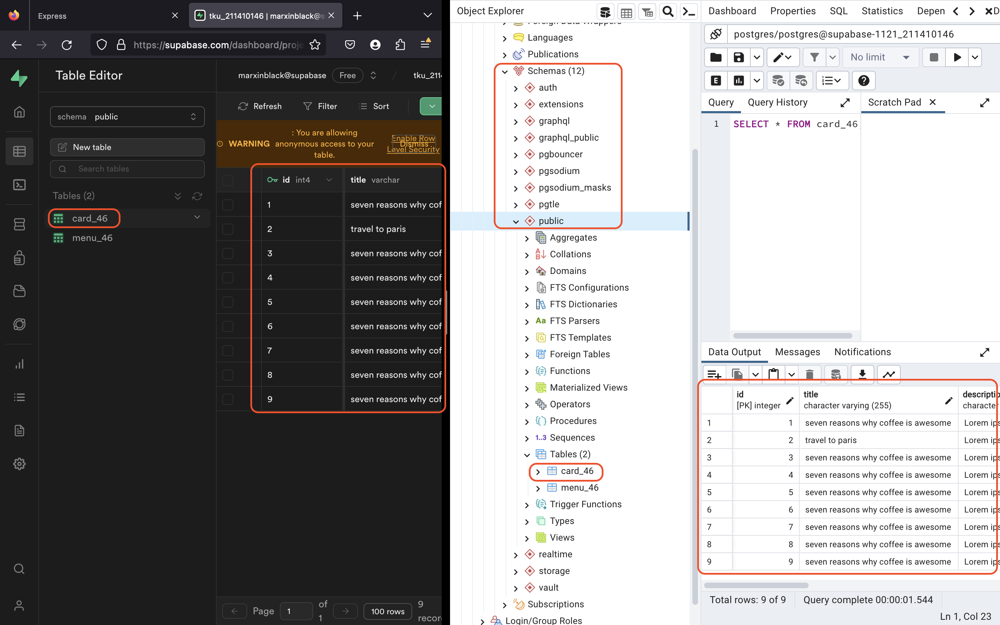
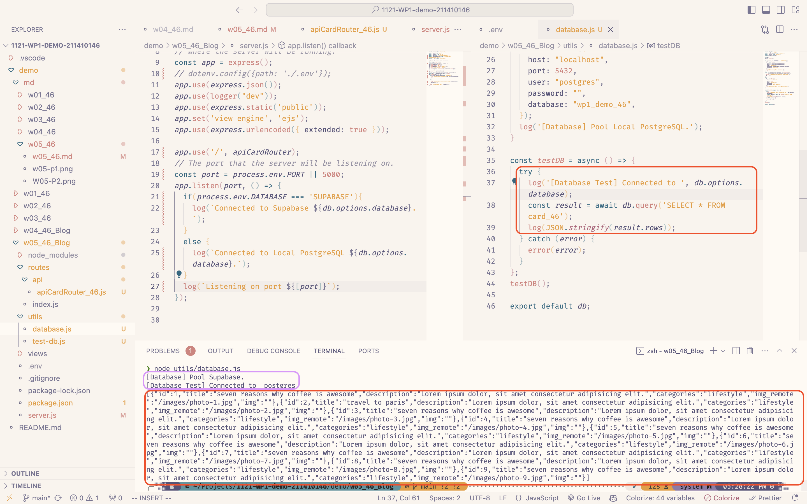
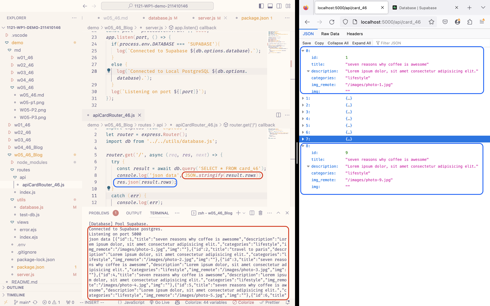

[Github Page](https://github.com/marx-w/1121-WP1-demo-211410146.git)

### W05-P1: Demo how to use environment variable DATABASE


### W05-P2: Using pgAdmin 4 to get table card_46 from Supabase.


### W05-P3: Using database.js to cennect Supabase and show card_46 data.


### W05-P4: For route /api/card_46, get Json from Supabase.


### W05-Logs: All Logs.
```
git log --pretty=format:"%h%x09%an%x09%ad%x09%s" --after="2023-10-10"
```
```
2dc61f9 Marx Wang       Thu Oct 12 17:48:22 2023 +0800  W05-P4: For route /api/card_46, get Json from Supabase.
b72d1c4 Marx Wang       Thu Oct 12 17:32:52 2023 +0800  W05-P3: Using database.js to cennect Supabase and show card_46 data.
683a893 Marx Wang       Wed Oct 11 19:56:54 2023 +0800  W05-P2: Using pgAdmin 4 to get table card_46 from Supabase.
135a651 Marx Wang       Wed Oct 11 19:55:12 2023 +0800  W05-P1: Demo how to use environment variable DATABASE
```