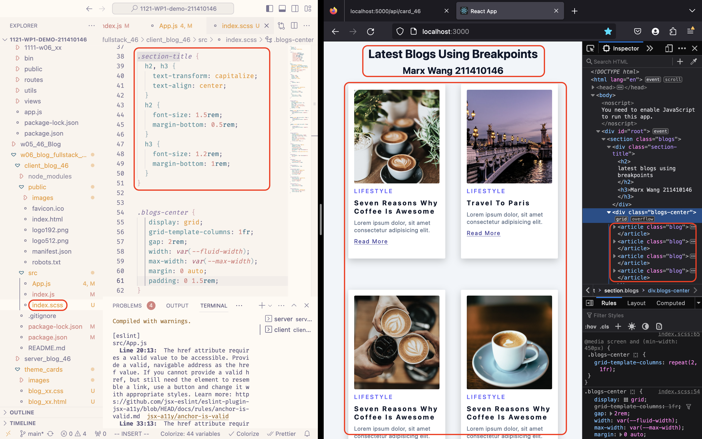

[Github Page](https://github.com/marx-w/1121-WP1-demo-211410146.git)

### W06-P1: Run the server in W5 using /api/card_46


### W06-P2: Blog theme html convert to React using scss.


### W06-P3: Use Route /static_46 to show <BlogStaticPage_46 />


### W06-P4: Fetch data from node server via route /node_46, show data in console.log


### W06-P5: Fetch data from node server via route /node_46, render all blogs data in webpage


### W06-Logs: All Logs.
```
git log --pretty=format:"%h%x09%an%x09%ad%x09%s" --after="2023-10-17"
```
```
c1fe02c Marx Wang       Wed Oct 18 21:17:11 2023 +0800  W06-P5: Fetch data from node server via route /node_46, render all blogs data in webpage
49eea47 Marx Wang       Wed Oct 18 20:52:53 2023 +0800  W06-P4: Fetch data from node server via route /node_46, show data in console.log
664b0a6 Marx Wang       Wed Oct 18 20:51:44 2023 +0800  W06-P3: Use Route /static_46 to show <BlogStaticPage_46 />
d01afbe Marx Wang       Wed Oct 18 19:20:38 2023 +0800  W06-P2: Blog theme html convert to React using scss.
2b8139d Marx Wang       Wed Oct 18 18:40:45 2023 +0800  W06-P1: Run the server in W5 using /api/card_46
6cb2f9c Marx Wang       Wed Oct 18 18:09:06 2023 +0800  231018: Week 6 Start.
```
