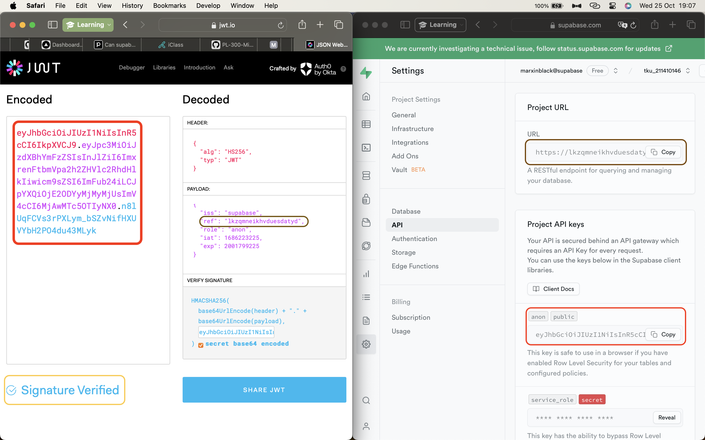
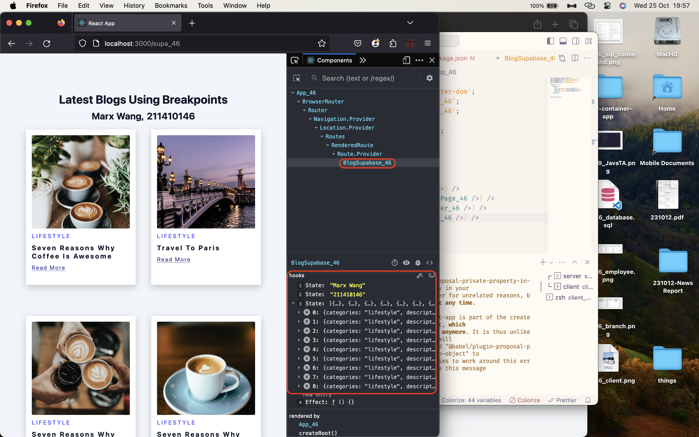
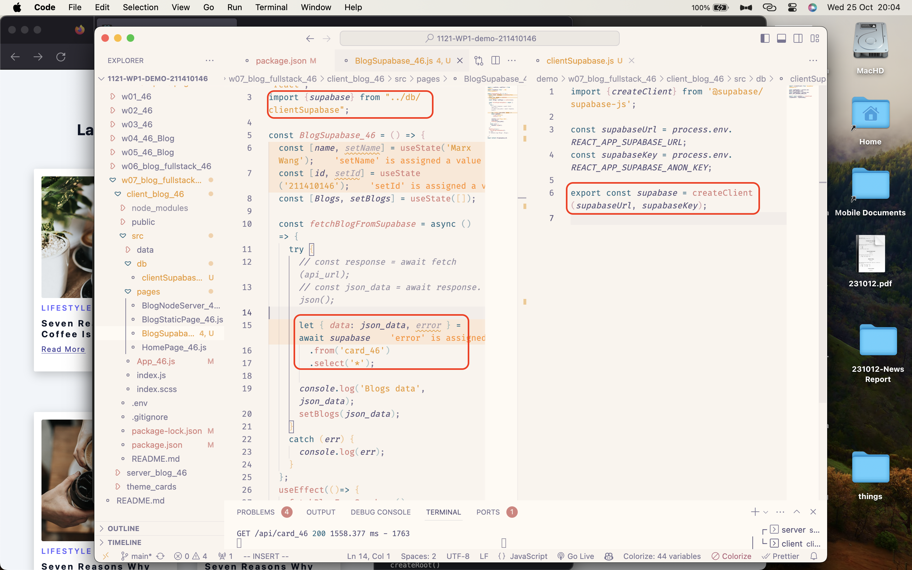
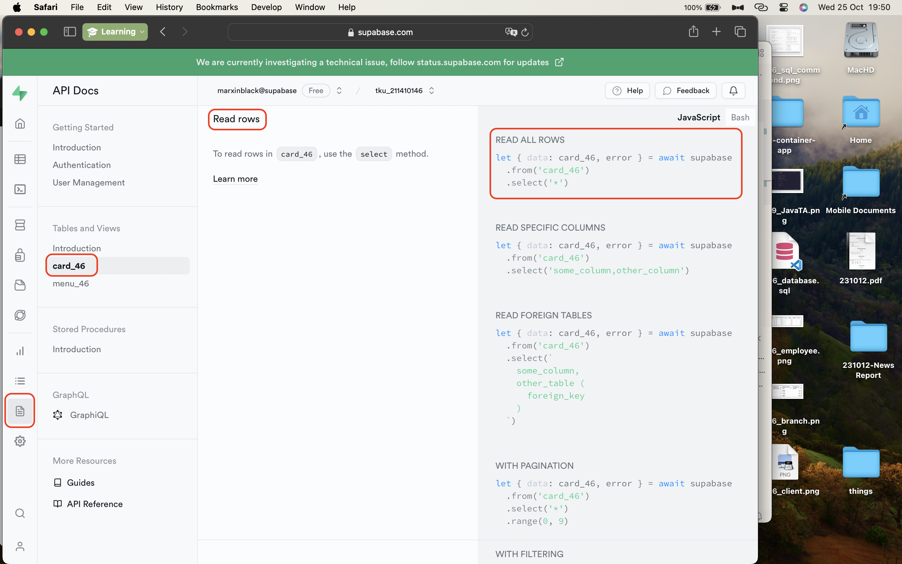
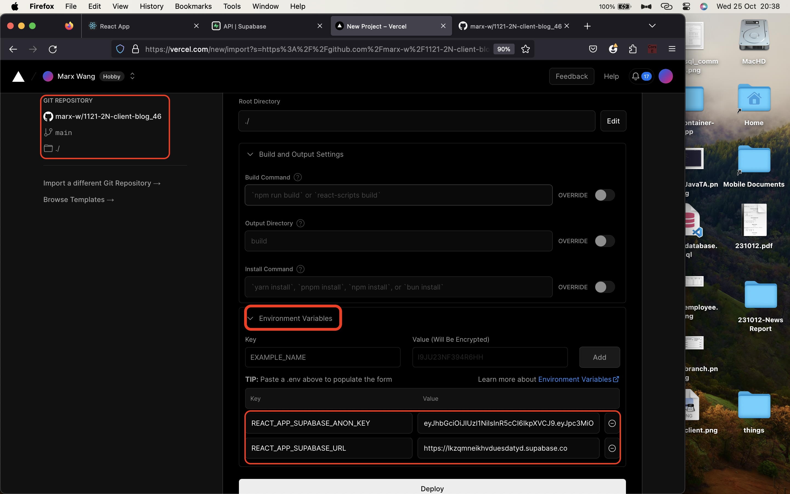
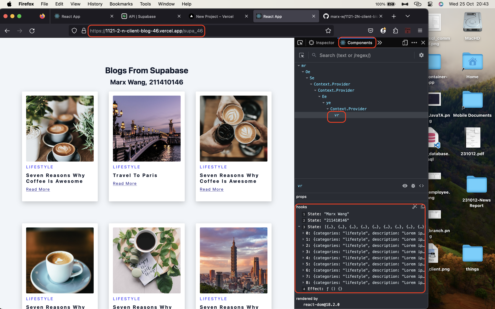
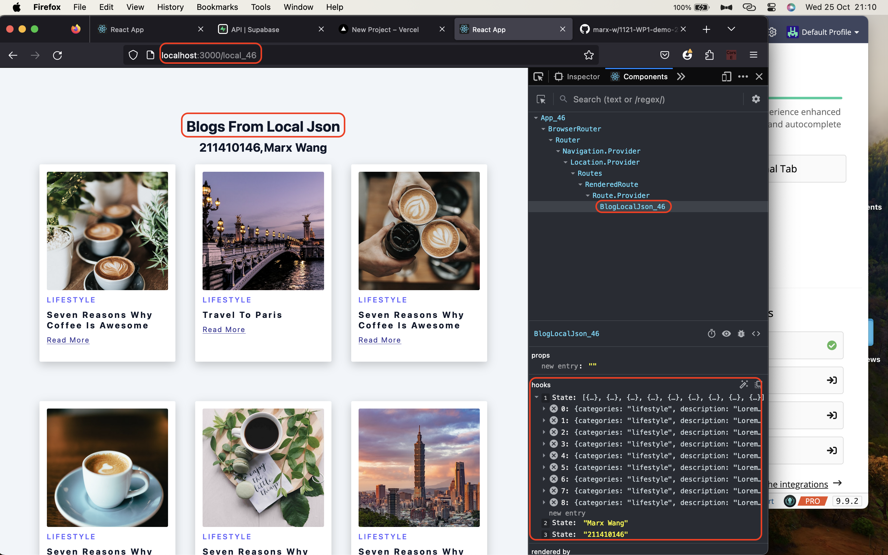
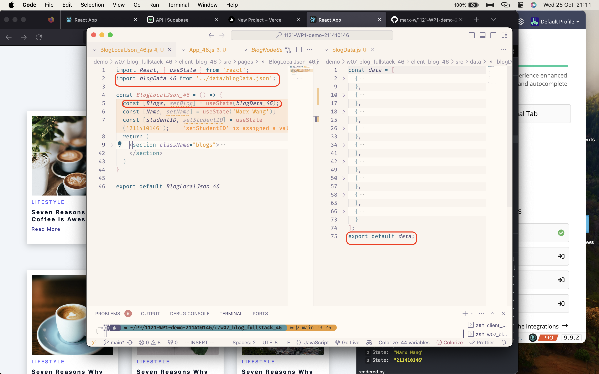
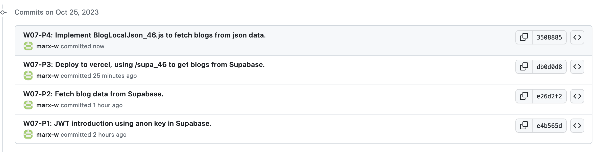

[Github Page](https://github.com/marx-w/1121-WP1-demo-211410146.git)

### W07-P1: JWT introduction using anon key in Supabase.


### W07-P2: Fetch blog data from Supabase.




### W07-P3: Deploy to vercel, using /supa_46 to get blogs from Supabase.
[Portal to Vercel](https://1121-2-n-client-blog-46.vercel.app/supa_46)



### W07-P4: Implement BlogLocalJson_46.js to fetch blogs from json data.



### W07-Logs: All Logs.
```
git log --pretty=format:"%h%x09%an%x09%ad%x09%s" --after="2023-10-24"
```
```
3508885 Marx Wang       Wed Oct 25 21:16:21 2023 +0800  W07-P4: Implement BlogLocalJson_46.js to fetch blogs from json data.
db0d0d8 Marx Wang       Wed Oct 25 20:51:38 2023 +0800  W07-P3: Deploy to vercel, using /supa_46 to get blogs from Supabase.
e26d2f2 Marx Wang       Wed Oct 25 20:07:48 2023 +0800  W07-P2: Fetch blog data from Supabase.
e4b565d Marx Wang       Wed Oct 25 19:13:05 2023 +0800  W07-P1: JWT introduction using anon key in Supabase.
```

