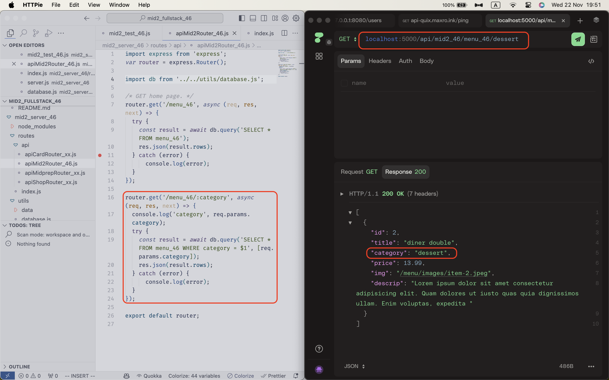

[Way to my github repo](https://github.com/marx-w/1121-WP1-demo-211410146.git)

### W11-P1: Implement /api/mid2_46/menu_46/:category

### W11-P2: Implement /mid2_node_46 in React to get menu data from node server.

### W11-P3: Implement /mid2_cat_node in React to get category data from node server.

### W11-P4: Create two menu data with category 'dinner', and get these two data from React 'Dinner' button.

**In PGAdmin, show two newly added data.**

**In React, show two newly added data by pressing button.**

