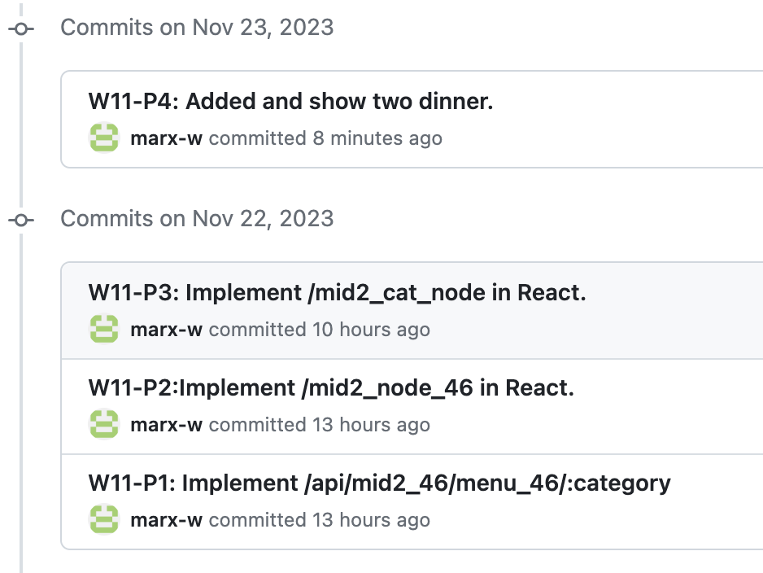

[Way to my github repo](https://github.com/marx-w/1121-WP1-demo-211410146.git)

### W11-P1: Implement /api/mid2_46/menu_46/:category


### W11-P2: Implement /mid2_node_46 in React to get menu data from node server.


### W11-P3: Implement /mid2_cat_node in React to get category data from node server.


### W11-P4: Create two menu data with category 'dinner', and get these two data from React 'Dinner' button.

**In PGAdmin, show two newly added data.**


**In React, show two newly added data by pressing button.**


### W11-P5: W7 all logs



```
git log --pretty=format:"%h%x09%an%x09%ad%x09%s" --after="2023-11-21"
```
```
c0e4eee Marx Wang       Thu Nov 23 09:31:09 2023 +0800  W11-P4: Added and show two dinner.
b3f03b7 Marx Wang       Wed Nov 22 23:09:46 2023 +0800  W11-P3: Implement /mid2_cat_node in React.
ad02fc1 Marx Wang       Wed Nov 22 20:36:31 2023 +0800  W11-P2:Implement /mid2_node_46 in React.
fb68c55 Marx Wang       Wed Nov 22 19:55:21 2023 +0800  W11-P1: Implement /api/mid2_46/menu_46/:category
```