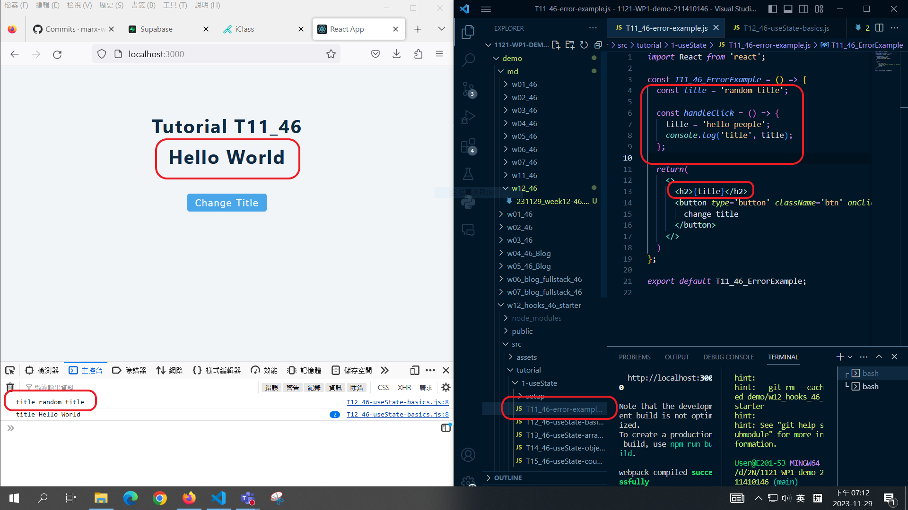
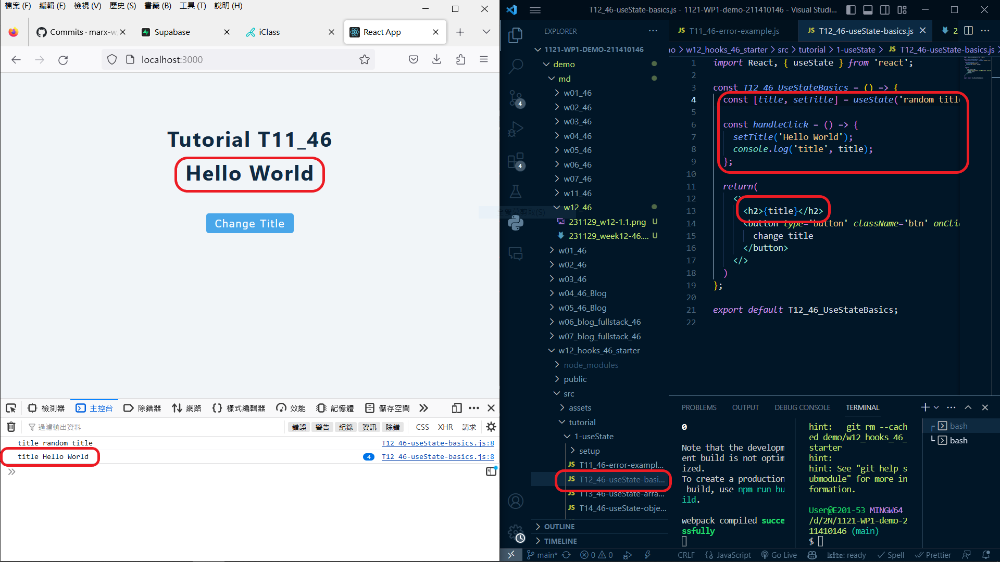
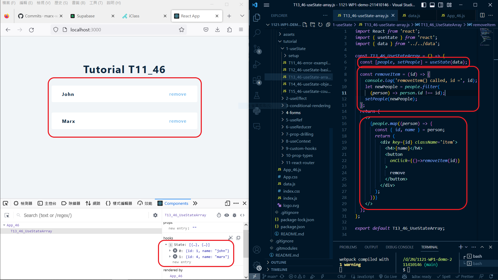
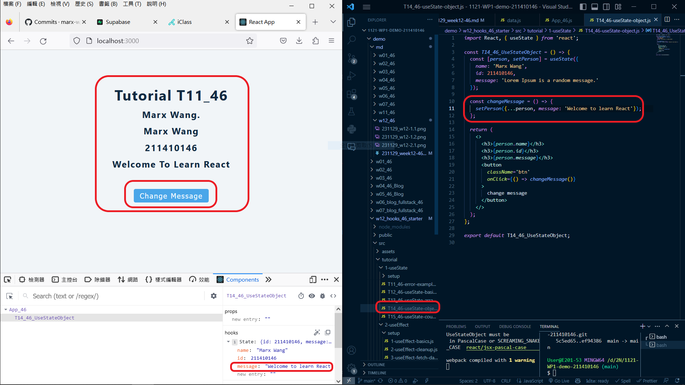
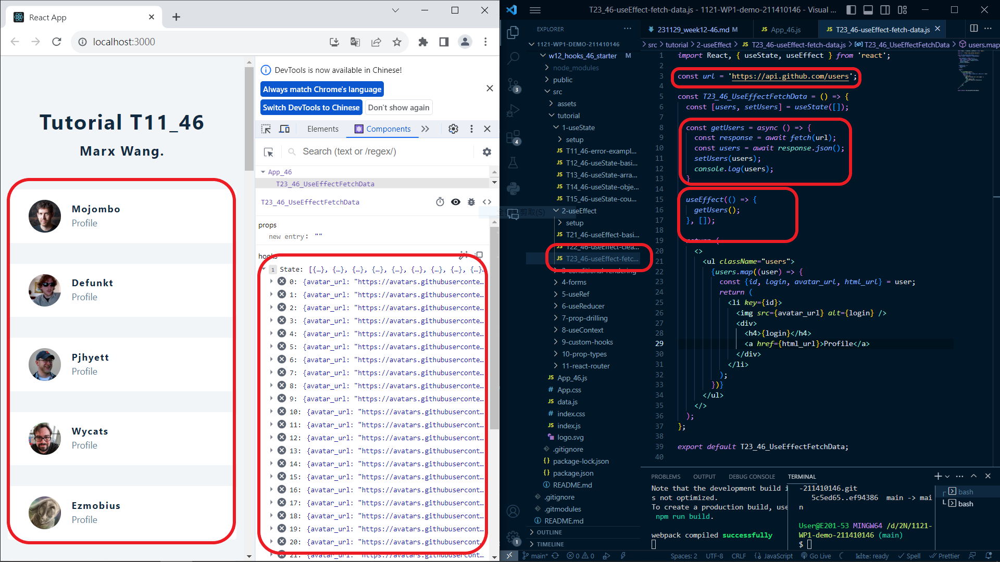

[Way to my github repo](https://github.com/marx-w/1121-WP1-demo-211410146.git)

### W12-P1: Do advanced hooks: T11_46 & T12_46.




### W12-P2: Do T13_46 Using Array.



### W12-P3: Do T14_46 using object.



### W12-P4: Do T23_46, fetch Github users using useEffect.



### W12-P5: All Logs.

```
git log --pretty=format:"%h%x09%an%x09%ad%x09%s" --after="2023-11-28"
```

```

```
