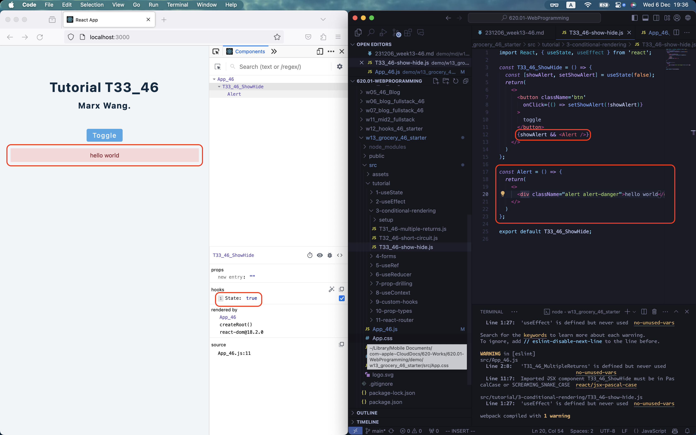

[Way to my github repo](https://github.com/marx-w/1121-WP1-demo-211410146.git)

### W13-P1: Do T31 conditional rendering by checking isloading, isError, or fetch user data correctly


### W13-P2: Do T33 toggle Alert message.


### W13-P3: Do T41 using form by input name and email.


### W13-P4: Do Grocery bud, show shopping list, and clear list.


```
git log --pretty=format:"%h%x09%an%x09%ad%x09%s" --after="2023-12-05"
```

```

```
