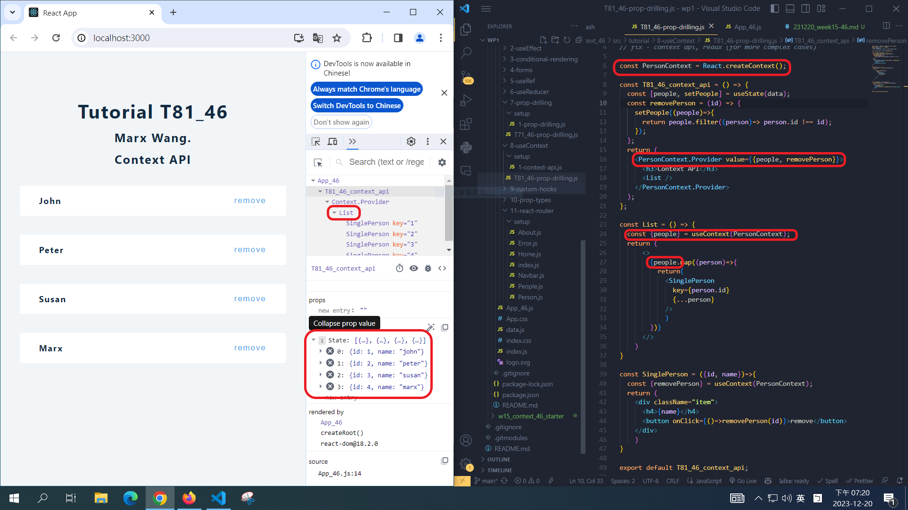
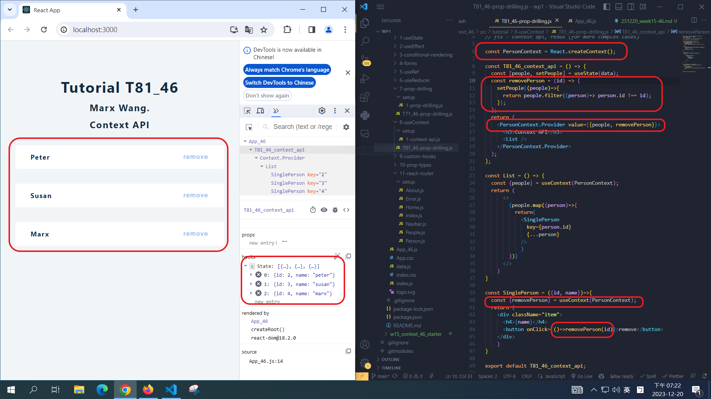
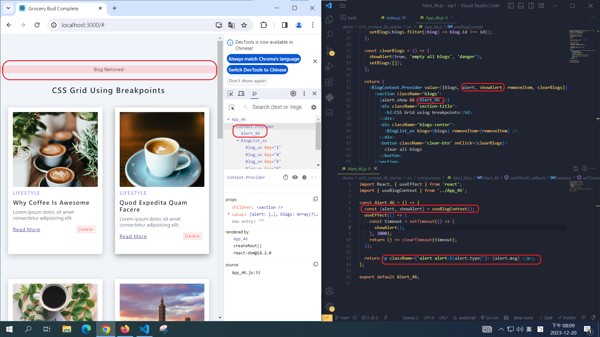
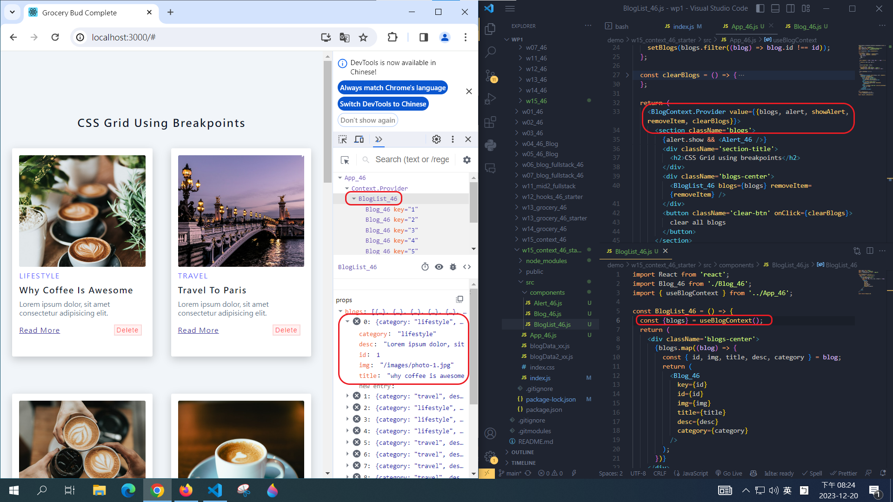

# Week 15

[Way to my github repo](https://github.com/marx-w/1121-WP1-demo-211410146.git)

## W15-P1: Do T81_46, using context to solve prop drilling of T71_46




## W15-P2: Implement Alert_46 using Blog Context Provider



## W15-P3: Implement Bloglist_46 and Blog_46 from BlogContext provider.



## W15-Logs: All logs

```
git log --pretty=format:"%h%x09%an%x09%ad%x09%s" --after="2023-12-20"
```

```

```
